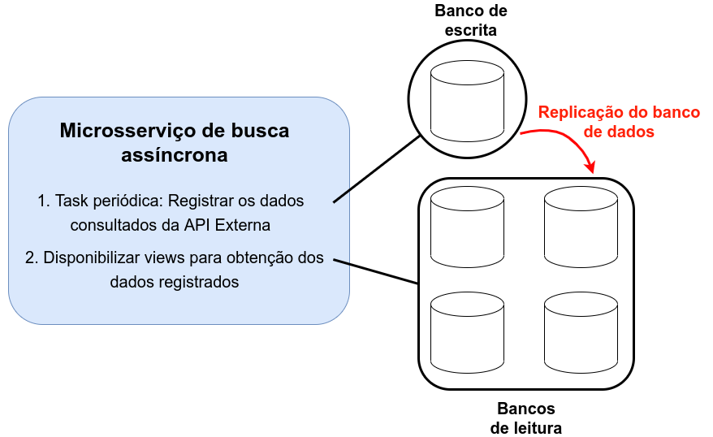

# Arquitetura

É possível contornar o problema da lentidão no acesso aos bancos de dados adicionando a [replicação do banco de dados](https://searchdatamanagement.techtarget.com/definition/database-replication) ao design de microsserviços de busca assíncrona.

Em projetos Python a estratégia de **[cache](https://docs.djangoproject.com/en/4.0/topics/cache/)** pode ser aplicada utilizando Memcached ou Redis na infraestrutura e algumas linhas de comando na implementação das views. 